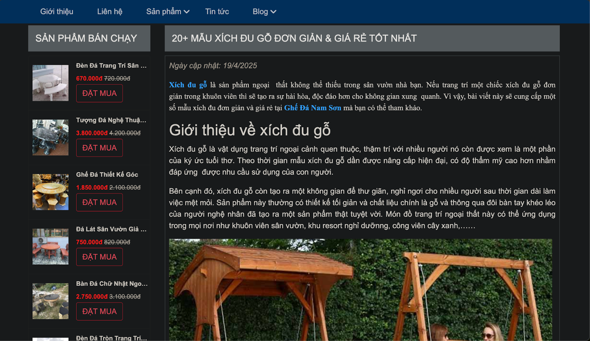

# E-commerce website 

## Technologies Used
This project leverages modern web development tools and frameworks to deliver a smooth experience:
- **Node.js**: A JavaScript runtime for building scalable server-side applications.
- **Express.js**: A web framework for Node.js to handle routing and middleware.
- **MongoDB**: A NoSQL database for storing application data.
- **Mongoose**: An ODM (Object Data Modeling) library for MongoDB and Node.js.
- **EJS**: A templating engine to render dynamic HTML pages (Viewer).

## Features
- **User Authentication**: Sign up, log in, and log out securely with NextAuth.js.
- **Responsive Design**: Works seamlessly on both desktop and mobile devices thanks to Bootstrap.

## Project Architecture
This project follows the **MVC (Model-View-Controller)** architecture to ensure a clean separation of concerns and maintainable code. Below is a diagram illustrating the flow of data in the application:

### Breakdown:
- **Model (MongoDB + Mongoose)**: 
  - The Model layer handles the data logic and interacts with the MongoDB database using Mongoose as the ODM (Object Data Modeling) library. It defines the schema for data (e.g., users, products, orders) and manages CRUD operations (Create, Read, Update, Delete).
  - In this project, MongoDB stores all the e-commerce data, such as product listings, user profiles, and order history.

- **View (EJS)**:
  - The View layer is responsible for rendering the user interface. We use EJS (Embedded JavaScript) as the templating engine to generate dynamic HTML pages. EJS templates receive data from the Controller and display it to the user in the browser.
  - For example, product pages, user dashboards, and shopping carts are rendered using EJS.

- **Controller (Node.js + Express.js)**:
  - The Controller acts as the intermediary between the Model and View. It handles user requests, processes business logic, and coordinates the flow of data.
  - **Web Server (Express.js)**: Built with Express.js, the web server listens for incoming HTTP requests (e.g., GET, POST) from the browser.
  - **Routes**: Express.js defines routes (e.g., `/products`, `/cart`, `/sign-in`) to map URLs to specific controller functions.
  - **Dispatcher**: The dispatcher in Express.js routes the request to the appropriate controller based on the URL and HTTP method.

- **Flow of Data**:
  1. The **Browser** sends an HTTP request to the **Web Server**.
  2. The **Routes** and **Dispatcher** (handled by Express.js) direct the request to the appropriate **Controller**.
  3. The **Controller** interacts with the **Model** to fetch or update data in **MongoDB** (via Mongoose).
  4. The **Controller** then passes the processed data to the **View** (EJS templates).
  5. The **View** renders the HTML and sends it back to the **Browser** for display.

This MVC structure ensures that the application is modular, scalable, and easy to maintain.

## Demo 

